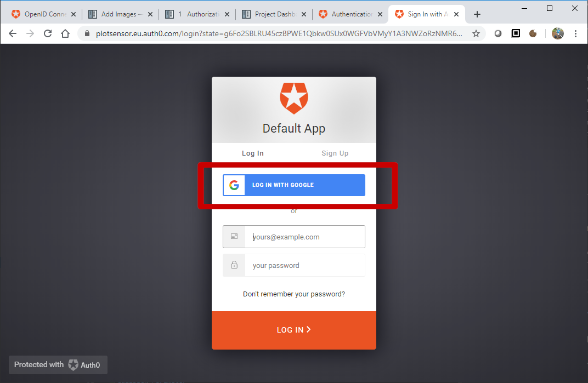

.. sectnum::

Authorization
=======================

Some API endpoints require authorization. Only users with a third party account
(e.g. Google or Facebook) are granted access. Such accounts
cannot be set up without some human interaction. The requirement
for user authentication guards against bots filling the wsbackend database with rubbish.

The websensor Web Application
uses the `Open ID Connect <https://auth0.com/docs/protocols/oidc>`_ (OIDC) protocol to communicate
with a third-party identity provider (IdP). When a user authenticates, the IdP produces
an `access token <https://www.oauth.com/oauth2-servers/access-tokens/>`_. This token is
unique to a user and decodes to a number of claims. These include:

    * User name.
    * Audience (URL of the websensor API for which access has been granted).
    * Issuer (URL of the identity provider).
    * Issued timestamp.
    * Expiry timestamp.
    * Scope (granular API permissions).

Tokens are not encrypted. They **must** always be transmitted through a
secure channel (HTTPS). The value of tokens is they include a `digital signature <https://en.wikipedia.org/wiki/Digital_signature>`_.
If signature verification is successful then the claims can be trusted. In this way access
tokens are used to access protected API resources.

The access token also grants the Web Application permission to read some **personal data** about
a user (e.g. name and profile picture). Crucially these data are not stored in the Web Application itself.
They are requested by making an
API call to ``/userinfo`` API endpoint of the IdP. It can be assumed that the IdP handles these data
in a secure and GDPR compliant way.

Production
-------------
In a production environment, the IdP is `Auth0.com <https://auth0.com>`_. Others can be used
if they adhere to the OIDC protocol.

Auth0.com acts as an intermediary. It allows users to authenticate with a large
number of OAuth2 providers such as Google, GitHub and Facebook.

Obtain an API Access Token
^^^^^^^^^^^^^^^^^^^^^^^^^^^
wsfrontend obtains an access token fom the identify provider using the `Authorization Code Grant Flow <https://auth0.com/docs/api-auth/tutorials/authorization-code-grant>`_.

User Clicks Sign In
~~~~~~~~~~~~~~~~~~~~~~~
wsfrontend directs user to the ``/authorize`` endpoint on Auth0.com (`docs <https://auth0.com/docs/api/authentication#authorization-code-flow>`_)::

    callbackurl = url_for('dashboard.callback', _external=True)
    authorizeurl = "{AUTH0_URL}/authorize?" \
                   "response_type=code&" \
                   "client_id={AUTH0_CLIENTID}&" \
                   "redirect_uri={callbackurl}&" \
                   "scope=openid%20profile&" \
                   "audience={API_AUDIENCE}")
    return redirect(authorizeurl)

Audience Parameter
******************
Request authorization for ``API_AUDIENCE`` (string).

I have set ``API_AUDIENCE = https://api.websensor.io``. The value itself is not significant. The URL does not need to be reachable.

The audience strings used by wsfrontend (for token request) and wsbackend (for token validation) **must** be equal.
It should also be the name of an API registered on Auth0.com.

.. image:: auth0_api_page.png
   :width: 400
   :alt: Screenshot of Auth0 API page showing API Audience

Scope Parameter
****************
Request authorization for scopes ``OpenID`` and ``Profile``. These are `OIDC scopes <https://auth0.com/docs/scopes/current/oidc-scopes>`_.
An access token with these scopes has permission to call the ``/userinfo``  API endpoint of the IdP. Auth0.com will
`respond <https://auth0.com/docs/api/authentication#get-user-info>`_ with basic user information such as a name and profile picture.

Scopes that grant permission for sensitive wsbackend endpoints may be defined in future.
A user with the ``administrator`` role will be granted scopes such as ``write:credits`` to be used with ``POST api/credits``. Ordinary users
will just be given a collection of ``read`` scopes.

.. _callback:

Callback Parameter
*******************
Auth0.com redirects back to this URL on wsfrontend when the authorization step is complete. If successful, Auth0.com appends an
authorization code under the ``code=`` parameter.

User Authenticates on Auth0.com
~~~~~~~~~~~~~~~~~~~~~~~~~~~~~~~~~~~
Authentication happens when the user clicks the *log in with Google* button.

Auth0.com redirects back to the `<callback_>`_ URL.

Authorization Code is Exchanged for an Access Token
~~~~~~~~~~~~~~~~~~~~~~~~~~~~~~~~~~~~~~~~~~~~~~~~~~~
#. wsfrontend extracts authorization code from the callback URL.
#. wsfrontend sends code in a POST request to Auth0.com (`POST /oauth/token <https://auth0.com/docs/api/authentication#get-token>`_).
#. Auth0.com responds with an access token::

    HTTP/1.1 200 OK
    Content-Type: application/json
    {
      "access_token":"eyJz93a...k4laUWw",
      "token_type":"Bearer",
      "expires_in":86400
    }

Protected API Resource Called
^^^^^^^^^^^^^^^^^^^^^^^^^^^^^^^^^^^^^^^^^^^
wsfrontend calls wsbackend endpoints with the access token::

    curl -X GET "https://websensor.io/api/consumer/v1/me" -H "accept: application/json" -H "Authorization: Bearer eyJhbGciOiJS... ZOA4t7Q"

Access Token Validated
^^^^^^^^^^^^^^^^^^^^^^^^^^^^^^^^^^^^^^^^^^^^^^^^^^^^^^^^^^^^^^^
The access token signature is generated asymetrically (RS-256).
A private key (on Auth0.com) generates the signature. A public key
(hosted by Auth0.com) is used for validation.

wsbackend downloads the ``public_key`` (JWKs) from Auth0.com::

    GET {AUTH0_URL}/.well-known/jwks.json

Signature verification and decoding are performed using `PyJWT <https://pyjwt.readthedocs.io/en/latest/>`_::

    decoded = jwt.decode(
                token,
                public_key,
                algorithms=self.algorithms,
                audience={API_AUDIENCE},
                issuer={AUTH0_URL}
                )

An exception is raised if validation fails. The token is rejected, authorization fails and the API
responds with an error ``403: Forbidden``.

Protected Resource Content are Served
^^^^^^^^^^^^^^^^^^^^^^^^^^^^^^^^^^^^^^^^^
If validation succeeeds, wsbackend transmits a ``200 OK`` response to the wsfrontend, along with the requested resource data.

Testing
--------
For test, the OIDC provider is substituted with a mock https://www.npmjs.com/package/oauth2-mock-server
Access tokens are obtained from this using the client-creditials OAuth2 flow. Userinfo can also be mocked up.
Access tokens are verified by downloading the JSON Web Key set from the mock OIDC provider.