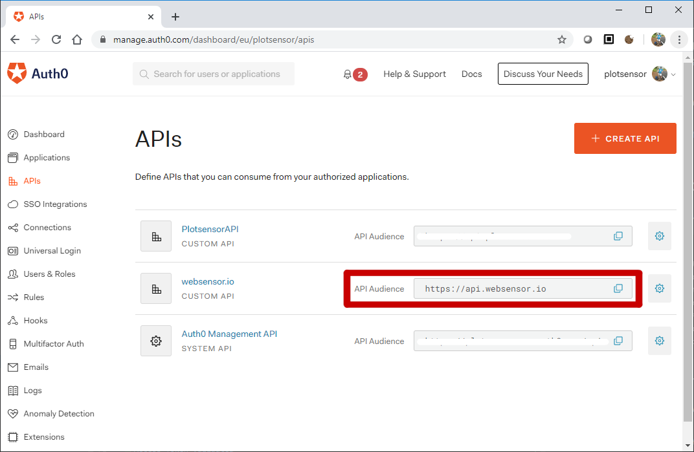

.. sectnum::

Authorization
=======================

Some API endpoints require authorization. Only users with a third party account
(e.g. Google or Facebook) are granted access. Such accounts
cannot be set up without some human interaction. The requirement
for user authentication guards against bots filling the wsbackend database with rubbish.

The websensor Web Application
uses the `Open ID Connect <https://auth0.com/docs/protocols/oidc>`_ (OIDC) protocol to communicate
with a third-party identity provider (IdP). When a user authenticates, the IdP produces
an `access token <https://www.oauth.com/oauth2-servers/access-tokens/>`_. This token is
unique to a user and decodes to a number of claims. These include:

    * User name.
    * Audience (URL of the websensor API for which access has been granted).
    * Issuer (URL of the identity provider).
    * Issued timestamp.
    * Expiry timestamp.
    * Scope (granular API permissions).

Tokens are not encrypted. They **must** always be transmitted through a
secure channel (HTTPS). The value of tokens is they include a `digital signature <https://en.wikipedia.org/wiki/Digital_signature>`_.
If signature verification is successful then the claims can be trusted. In this way access
tokens are used to access protected API resources.

The access token also grants the Web Application permission to read some **personal data** about
a user (e.g. name and profile picture). Crucially these data are not stored in the Web Application itself.
They are requested by making an
API call to `/userinfo` API endpoint of the IdP. It can be assumed that the IdP handles these data
in a secure and GDPR compliant way.

Production
-------------
In a production environment, the identity provider is `Auth0.com <https://auth0.com>`_. Other
OIDC providers can be used. Auth0.com acts as an intermediary. It allows users to authenticate with a large
number of OAuth2 providers such as Google, GitHub and Facebook.

Obtain an API Access Token
^^^^^^^^^^^^^^^^^^^^^^^^^^^
wsfrontend obtains an access token fom the identify provider using the `Authorization Code Grant Flow <https://auth0.com/docs/api-auth/tutorials/authorization-code-grant>`_.

User Clicks the Sign In Button
~~~~~~~~~~~~~~~~~~~~~~~~~~~~~~~~
wsfrontend directs user to the ``/authorize`` endpoint on Auth0.com::

    callbackurl = url_for('dashboard.callback', _external=True)
    authorizeurl = "{AUTH0_URL}/authorize?" \
                   "response_type=code&" \
                   "client_id={AUTH0_CLIENTID}&" \
                   "redirect_uri={callbackurl}&" \
                   "scope=openid%20profile&" \
                   "audience={API_AUDIENCE}")
    return redirect(authorizeurl)

Audience Claim
******************
This is set to the environment variable ``API_AUDIENCE``.
The value of this string is not important, but it must coincide with that of ``API_AUDIENCE`` in wsbackend.
It should also be the name of an API registered on Auth0.com.

Protected API Resource Called
^^^^^^^^^^^^^^^^^^^^^^^^^^^^^^^^^^^^^^^^^^^
wsfrontend calls protected wsbackend endpoints with the access token. It does this by adding an Authorization header to each HTTP request, with a value of Bearer,
followed by the access token.

Access Token Validated
^^^^^^^^^^^^^^^^^^^^^^^^^^^^^^^^^^^^^^^^^^^^^^^^^^^^^^^^^^^^^^^
wsbackend checks the signature of the access token by downloading the JWKs public key set.

#. Protected Resource Content are Served
^^^^^^^^^^^^^^^^^^^^^^^^^^^^^^^^^^^^^^^^^
If validation succeeeds, wsbackend transmits a 200 response to the wsfrontend. If not,
the response will normally be 403 forbidden.

Testing
--------
For test, the OIDC provider is substituted with a mock https://www.npmjs.com/package/oauth2-mock-server
Access tokens are obtained from this using the client-creditials OAuth2 flow. Userinfo can also be mocked up.
Access tokens are verified by downloading the JSON Web Key set from the mock OIDC provider.