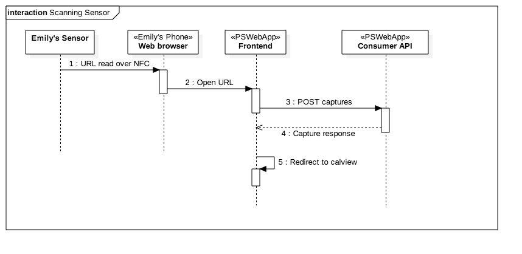
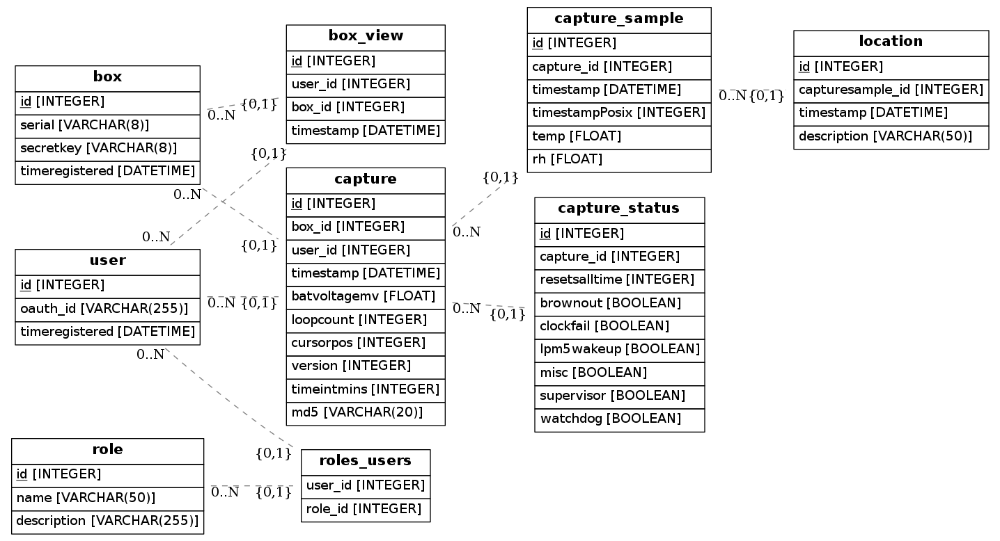

Software Requirement Specification
===================================

Platform Requirements
----------------------

PR-1
~~~~ 
There must be a low barrier-to-entry in terms of setup costs and knowledge.

PR-2
~~~~~
The platform must be secure.

PR-3
~~~~~
The platform shall be testable. Tests shall be automated where possible.

Functional Requirements
------------------------

FR-SEC-1
~~~~~~~~ 
The web application shall be secured at the application layer using HTTPS. Connections with HTTP must be rejected.

FR-SEC-2
~~~~~~~~~
HTTPS shall be enabled using Let's Encrypt certificates. These are free-of-charge in order to comply with PR-1_.

FR-SEC-3
~~~~~~~~~
No sensitive user data such as passwords shall be stored by the web application.

FR-AUTH-1
~~~~~~~~~~
The user does not need to authenticate in order to make basic use of the web application. For example, FR-WEB-12_ and FR-WEB-1_.

FR-AUTH-2
~~~~~~~~~~
The user has the option to authenticate to enable extra functionality. In general this is limited to cases where the user needs to write to the database, other than for capturing data from a sensor.

FR-AUTH-3
~~~~~~~~~~ 
Authentication shall be provided by a third party (See NG-1_, PR-1_).

FR-AUTH-4
~~~~~~~~~~
The web application shall determine user authenticity with access tokens.

FR-AUTH-5
~~~~~~~~~~
It shall be possible to designate a user as an Administrator.

FR-DB-1
~~~~~~~~ 
The web application shall store data in an SQL database. The chosen DB is PostgresSQL. 

FR-DB-2
~~~~~~~~
It shall be possible to migrate the DB schema when it changes. The chosen DB migration tool is Alembic.

FR-DB-3 
~~~~~~~~
Given a capturesample, it shall be possible to know where the tag was located, based on the sparse location markers that the user has created.
The capturesample will have a function for retrieving the most recent location marker for the tag that the capturesample belongs to.

FR
~~~
The web application must not be URL specific. This must be passed in as an environment variable. 

FR-API-1 
~~~~~~~~~
Only Administrators can create a tag.

FR-WEB-0 
~~~~~~~~~
There shall be a colour scheme associated with each sensor. This will be red for temperature data and light blue for RH data.

FR-WEB-1 
~~~~~~~~~
There shall be a <calendar_page> for viewing sensor data. Parameters of this page are:

* Sensor
* Range (day, week, month).
* Start date DD/MM/YYYY
* Timezone offset in minutes.

FR-WEB-2 
~~~~~~~~~
The timezone on the <calendar_page> shall default to the user's timezone if none is supplied in the URL.

FR-WEB-3 
~~~~~~~~~
The date of the <calendar_page> shall default to todays date if none is supplied in the URL.

FR-WEB-4 
~~~~~~~~~
Sensor data shall be browseable by selecting a date, sensor and range on the <calendar_page>. 

FR-WEB-5 
~~~~~~~~~
The URL must be consistent with the parameters selected on the <calendar_page>. These include year, month, day and timezone. 

FR-WEB
~~~~~~~
If Alice in timezone A sends the URL of a <calendar_page> to Bob in timezone B, Bob must see the same sensor data as Alice, as if he were in timezone A. For this to work, the timezone must be included in the URL. 

FR-WEB
~~~~~~~
If there is no timezone included in the URL, the web application should detect the user's timezone and write this to the URL (see FR-WEB-5_)

FR-WEB
~~~~~~~
If there is no date included in the URL, the web application should detect the current date for the user and write this to the URL. 

FR-WEB
~~~~~~~
If there is no range included in the URL, the web application should default to 'day'.

FR-WEB
~~~~~~~
If there is no sensor included in the URL, the web application should default to 'temp'. 

FR-WEB-6 
~~~~~~~~~
The <calendar_page> must update without reloading the entire page when the parameters are changed.

FR-WEB-7 
~~~~~~~~~
The <calendar_page> must include a plot of sensor data and a table of the same data.

FR-WEB-9 
~~~~~~~~~
The <calendar_page> will have a button for downloading displayed data as a CSV file. 

FR-WEB-10 
~~~~~~~~~~
The <calendar_page> will have a button for copying the current URL. This is a way for one user to share the current view with others, even if they are in a different timezone (see architecture, front end).

FR-WEB-11-1 
~~~~~~~~~~~~
It shall be possible to add location markers. These describe where the sensor was at a given time. 

FR-WEB-11-2 
~~~~~~~~~~~~
Each sample inside the table on <calendar_page> will have a button for adding a location. 

FR-WEB-11-3 
~~~~~~~~~~~~
If the sample has a location stored against it, the text on the button will be the description for that location. The button colour will be blue.

FR-WEB-11-4 
~~~~~~~~~~~~
If the tag has previous locations stored against it, the text on the button will be the description for the most recent location (FR-DB-3). The button colour will be grey.

FR-WEB-11-3 
~~~~~~~~~~~~
If the tag has no previous locations stored against it, the text on the button will be 'Add Location'. The button colour will be grey.

FR-WEB-11-5 
~~~~~~~~~~~~
Clicking on a grey location button will make a modal window appear that prompts the user to describe a new sensor location. 

FR-WEB-11-6 
~~~~~~~~~~~~
Clicking on a blue location button will make a modal window appear for the user to edit the location description or to delete the location marker entirely.

FR-WEB-12
~~~~~~~~~~
The web application must be capable of parsing, decoding and storing samples from a URL that has been created by a sensor. Data must be stored permanently in the database.

Non-goals
---------

It is outside the scope of this project to do the following:

NG-1 
~~~~~
Providing a user-authentication mechanism. (See `User Authentication`_ ). 

Quickstart
===========

End-user
---------
Android
~~~~~~~~

iOS
~~~~

Administrator
--------------
Quickstart shall cover how to install the web application using Docker and Docker-machine.

Feature Documentation
======================

End-user Docs
--------------

USR-FEAT-4 How to download sensor data as a CSV file. 

USR-FEAT-5 How to share sensor data with others.

USR-FEAT-6 How to browse sensor data.

USR-FEAT-7 How to add and edit location markers.

Administrator Docs
-------------------

ADMIN-FEAT-1 How to renew the HTTPS certificate.

ADMIN-FEAT-2 How to designate a user as admin.

ADMIN-FEAT-3 How to migrate the DB using alembic.

Developer Docs
---------------

Software Architecture
======================
PSWebApp is the name of the Web Application component of Plotsensor. It is split into a frontend and a backend.
As usual, the frontend interacts with the users whilst the backend manages resources in the database.
The backend consists of two web APIs: the consumer API and the admin API.

Consumer API
------------

Open Endpoints
~~~~~~~~~~~~~~~
A frontend web application will interact exclusively with the consumer API. Here is an example of its use:

1. End-user Emily
    a) Emily hovers her phone over the sensor.
    b) The URL is read from the sensor NFC tag.
    c) The browser pops up on Emily's phone and makes a request to the URL.
2. Frontend
    a) Receives the URL and extracts parameters from its query string.
    b) These parameters are posted to the /captures endpoint of the consumer API.
3. Consumer API
    a) Decodes the capture.
    b) Verifies that it has come from a sensor and has not be altered or created by Mischievious Mike.
    c) Stores the capture in the database.
    d) Responds to frontend with the capture.
4.  The frontend presents Emily with her sensor data (without going into detail).
5.  Emily blinks.

Where possible, consumer API endpoints are open. This implements specification FR-AUTH-1_. Other
endpoints require user authentication.

Examples of open endpoints are /samples that allow the frontend to request sensor data in a given time range. In the
use-case above, PSWebApp must not nag emily to log in before revealing her data. Lest she get fed up and read the
temperature from her old-fashioned thermometer instead.

It is vital that open endpoints prevent hoodlums from filling the database with rubbish. That is why nearly all of them
are read-only (a.k.a. GET) requests.
An exception is the POST captures endpoint, but its openness is deceptive. A new capture
will not be created unless the POSTed data has originated from a registered tag.

User Authentication Endpoints
~~~~~~~~~~~~~~~~~~~~~~~~~~~~~~~
Some resources on PSWebApp are user-specific. An example is /tagviews.

1. Registered-user Ruth receives a link to a tag on WhatsApp.
   The message is from Grandma, who put the tag in her fridge.
2. Ruth follows the link and lands on the <<tag page>>. She logs in.
3. The frontend makes a POST request to the /tagviews endpoint to log that user Ruth has viewed this tag.
4. Ruth is intrigued that the temperature of Grandma's fridge is sometimes getting to 5 degrees C.
5. *Three weeks later*
6. Ruth's Grandma tells her to take another look at the sensor online. It got up to 10 degrees yesterday and
   the milk has gone lumpy.
7. Ruth logs into the frontend and lands on the <<user page>>. She cannot remember the serial of Grandma's tag
   and scrolling up on WhatsApp is too much work.
8. The frontend makes GET requests to the /tagviews endpoint and obtains a list of recently viewed tags
   and when they were viewed.
9. Ruth selects the tag she viewed "3 weeks ago".
10. Ruth agrees that Grandma should buy a new fridge.

Capture Required Endpoints
~~~~~~~~~~~~~~~~~~~~~~~~~~~~

Resources and Database Schema
-------------------------------

The following diagram shows the database schema

This is better handled by a 3rd party that has a better understanding of web security
